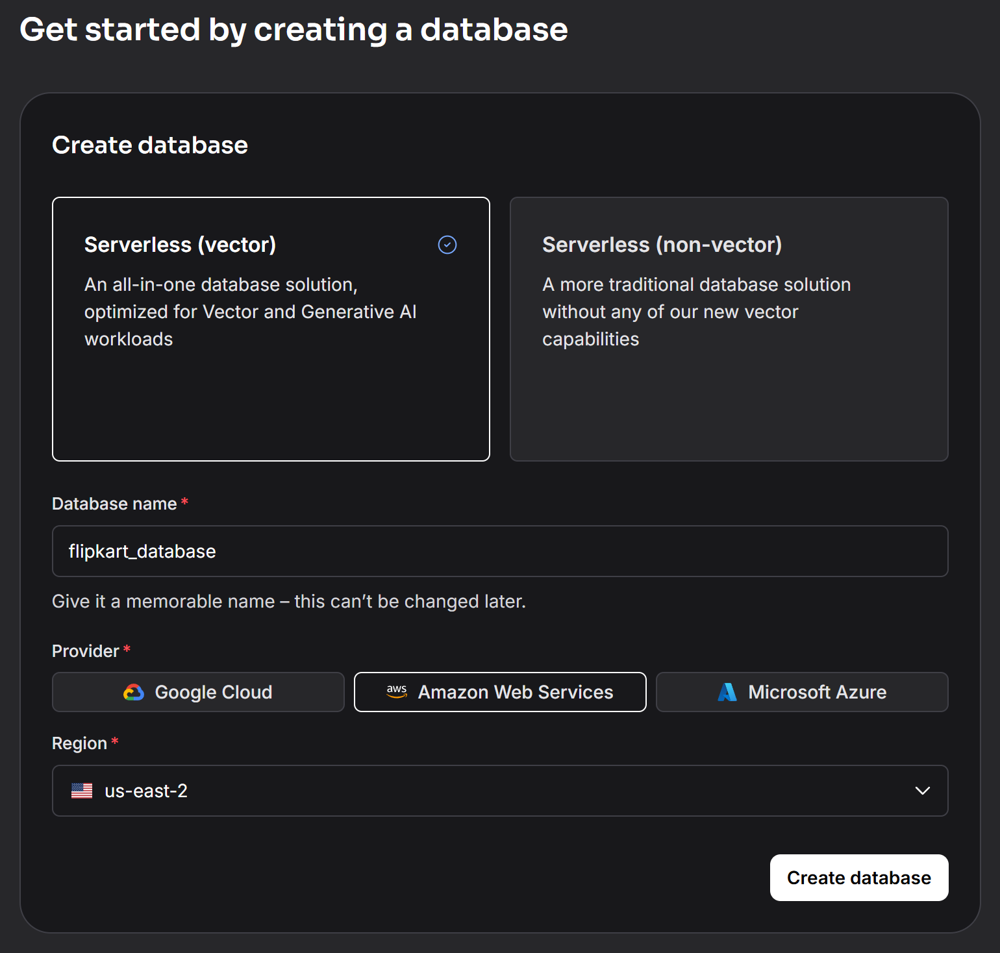
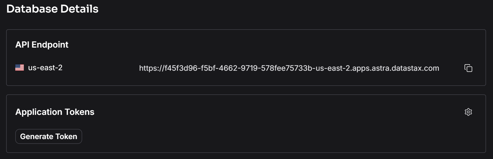

# 🏗️ **Initial Project Setup — LLMOps FlipKart Product Recommender**

This branch establishes the **foundational structure** for the **LLMOps FlipKart Product Recommender**.
It sets up a **modular Python codebase**, configures **dependency management with `uv`**, and prepares the repository for future stages — including **data ingestion**, **conversion to embeddings**, and **LLM-based recommendation pipelines**.

## 🗂️ **Project Structure**

```text
llmops-flipkart-product-recommender/
├── .env                                  # 🔑 Environment variables (API keys, tokens)
├── .gitignore                            # 🚫 Git ignore rules
├── .python-version                       # 🐍 Python version pin
├── data/
│   └── flipkart_product_review.csv       # 📊 Product review dataset
├── flipkart/                             # 🧠 Core package for data and LLM logic
│   └── __init__.py
├── grafana/                              # 📈 Monitoring dashboards (future integration)
├── prometheus/                           # 📊 Metrics collection setup (future use)
├── static/                               # 🌐 Static assets (if using a web interface)
├── templates/                            # 🎨 HTML templates (for Flask frontend)
├── utils/
│   ├── __init__.py
│   ├── custom_exception.py               # Unified exception handling across modules
│   └── logger.py                         # Centralised logging configuration
├── main.py                               # 🚀 Entry point for running the recommender
├── pyproject.toml                        # 🧩 Project metadata and uv configuration
├── requirements.txt                      # 📦 Python dependencies
├── setup.py                              # 🔧 Editable install configuration
├── uv.lock                               # 🔒 Dependency lock file (auto-generated by uv)
└── README.md                             # 📖 Project documentation (you are here)
```

> 💡 **Note:** The `.env` file contains sensitive API keys and must **never** be committed to version control.

## ⚙️ **Setup Process**

### 1️⃣ Create the Project Structure

A modular structure was designed for **clarity**, **scalability**, and **future LLM integration**, with separate folders for data, utilities, monitoring, and core FlipKart logic.

```bash
mkdir -p data flipkart utils grafana prometheus static templates
touch flipkart/__init__.py utils/__init__.py
```

Key modules were implemented in `utils/`:

* `custom_exception.py` — Ensures consistent, context-rich exception handling.
* `logger.py` — Implements time-stamped logging for transparency and debugging.

### 2️⃣ Create and Activate the Virtual Environment (with `uv`)

The project uses [`uv`](https://github.com/astral-sh/uv) for **fast, reproducible environments**.

Create and activate the environment (Python 3.12):

```bash
uv venv --python 3.12
```

* **Windows (cmd):**

  ```cmd
  .\.venv\Scripts\activate
  ```
* **PowerShell:**

  ```powershell
  .\.venv\Scripts\Activate.ps1
  ```
* **macOS / Linux:**

  ```bash
  source .venv/bin/activate
  ```

### 3️⃣ Define and Install Dependencies

An initial `requirements.txt` was created for early development:

```text
pandas
langchain
langchain-core
langchain-community
langchain-huggingface
langchain-astradb
langchain-groq
datasets
pypdf
python-dotenv
flask
prometheus_client
```

Install and lock dependencies:

```bash
uv pip install -r requirements.txt
uv lock
```

---

## 🔐 **Environment Variable Setup (.env)**

Before running any pipeline, a `.env` file must be created in the project root to store your API credentials.

Create the file:

```bash
touch .env
```

Then add the following entries:

```text
GROQ_API_KEY=""
HF_TOKEN=""
HUGGINGFACEHUB_API_TOKEN=""
ASTRA_DB_API_ENDPOINT=""
ASTRA_DB_APPLICATION_TOKEN=""
ASTRA_DB_KEYSPACE=""
```

### 🧠 **Where to Get These Keys**

**1️⃣ Groq API Key**
Go to [https://console.groq.com/](https://console.groq.com/) and sign in or create an account.
Generate a new API key and paste it into the `GROQ_API_KEY` field.

**2️⃣ Hugging Face Tokens**
Visit [https://huggingface.co/](https://huggingface.co/) → Profile → *Access Tokens*.
Create a new access token.
Use this same token for both `HF_TOKEN` and `HUGGINGFACEHUB_API_TOKEN`.

**3️⃣ AstraDB Credentials**
Go to [https://astra.datastax.com/](https://astra.datastax.com/) and log in with your account.

Create a new database:

<p align="center">
  
</p>

Wait for it to initialise (this can take a few minutes).
Once ready, you should see your database environment:

<p align="center">
  
</p>

Now:

* Copy the **API Endpoint** → `ASTRA_DB_API_ENDPOINT`
* Generate a **new Application Token** → `ASTRA_DB_APPLICATION_TOKEN`
* Set the **Keyspace** to `"default_keyspace"`

Your `.env` file should now contain valid API credentials for all required services.

---

### 4️⃣ Define Project Metadata

Project metadata and build configuration are stored in `pyproject.toml`:

```toml
[project]
name = "llmops-flipkart-product-recommender"
version = "0.1.0"
description = "An LLMOps project that builds a product recommender system for FlipKart reviews using large language models."
readme = "README.md"
requires-python = ">=3.12"

[tool.uv]
dev-dependencies = []
```

### 5️⃣ Install the Package in Editable Mode

To allow live updates during development:

```bash
uv pip install --editable .
```

Successful installation confirms your environment is ready.

---

## 🧩 **Integration Guidelines**

| Folder        | Purpose                                                               |
| ------------- | --------------------------------------------------------------------- |
| `flipkart/`   | Core modules for data ingestion, document conversion, and embeddings. |
| `data/`       | Product review dataset(s).                                            |
| `utils/`      | Logging and exception-handling utilities.                             |
| `grafana/`    | Monitoring and dashboard configuration (planned).                     |
| `prometheus/` | Metrics export configuration (planned).                               |
| `static/`     | Static assets for web integration.                                    |
| `templates/`  | HTML templates for Flask (future expansion).                          |

✅ **In summary:**

This setup establishes a **clean, modular, and extensible base** for the **LLMOps FlipKart Product Recommender**, supporting:

* Structured, reproducible environments via `uv`
* Centralised logging and exception handling
* Secure API configuration for Groq, Hugging Face, and AstraDB
* Ready integration with monitoring and visualisation tools

The next stage will involve **data ingestion and embedding pipelines**, transforming FlipKart reviews into **LLM-ready documents** for intelligent product recommendations.
