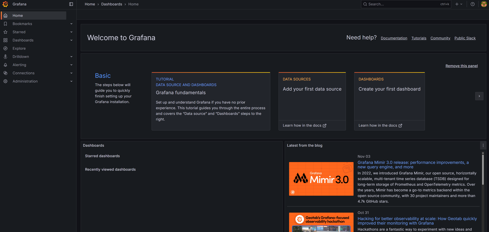
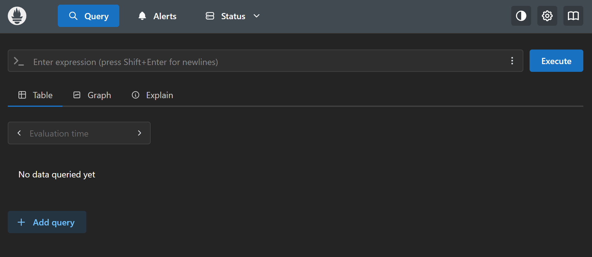
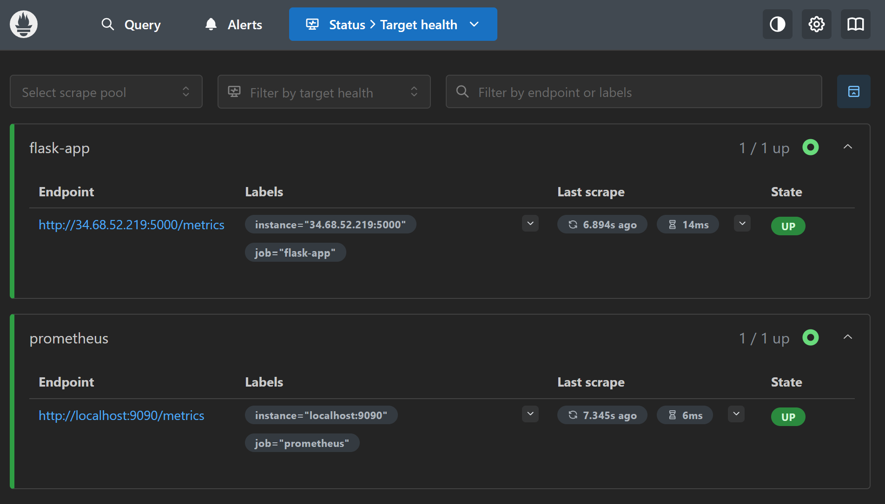
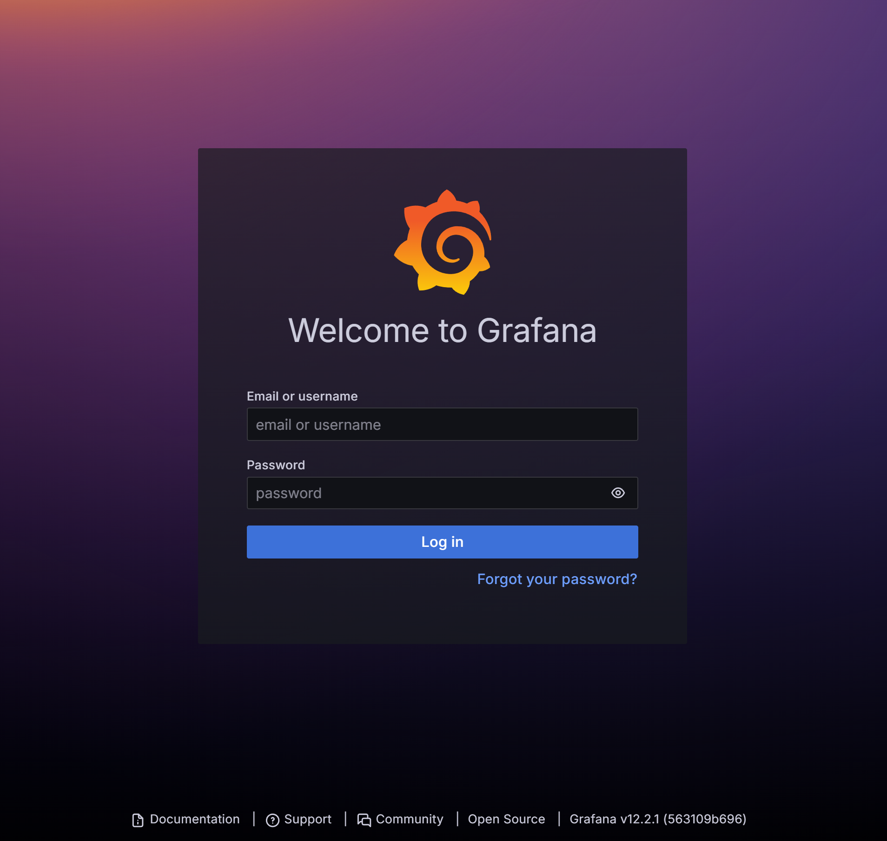
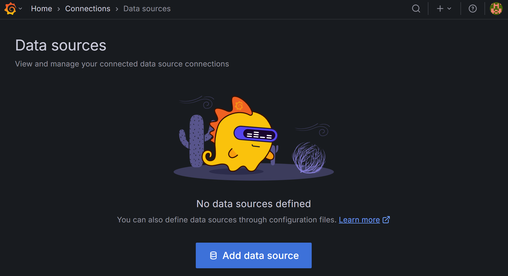
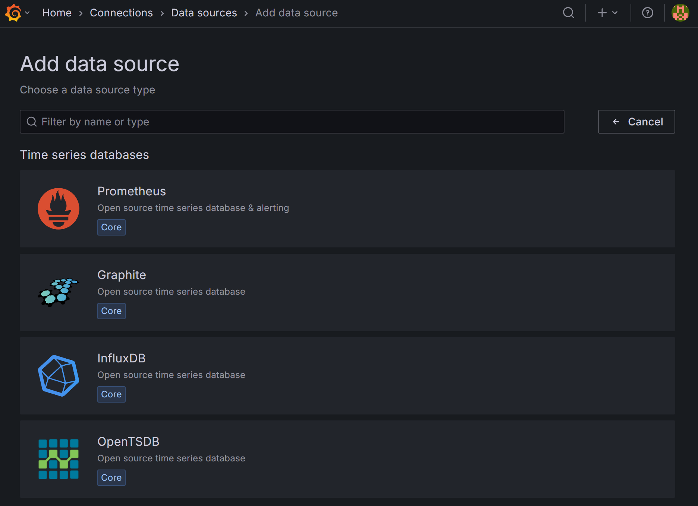
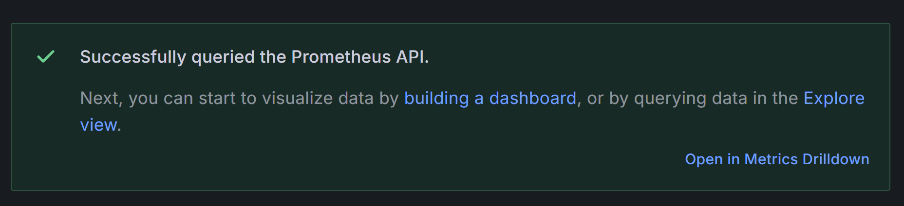
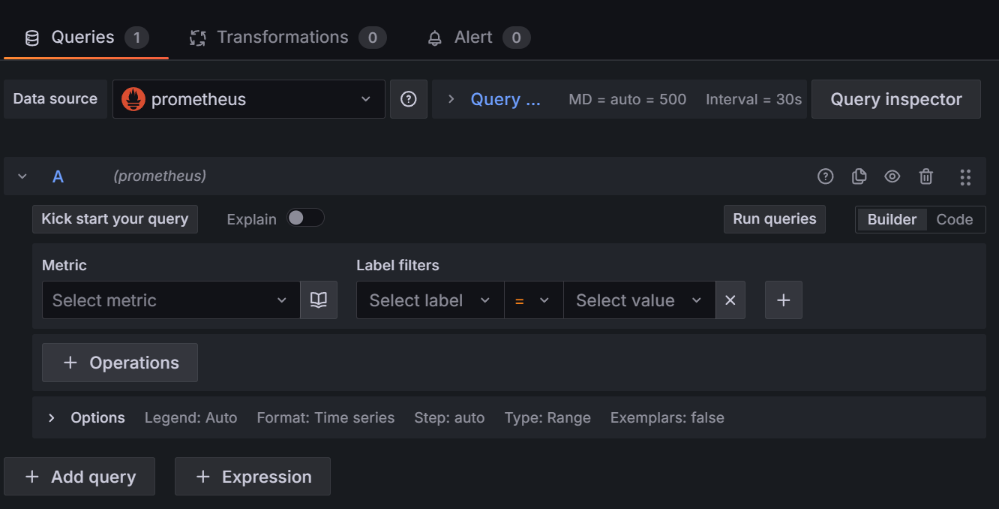
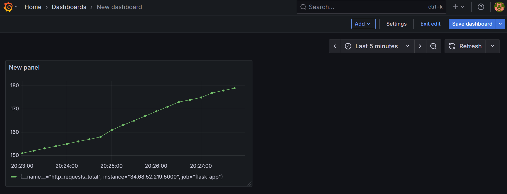
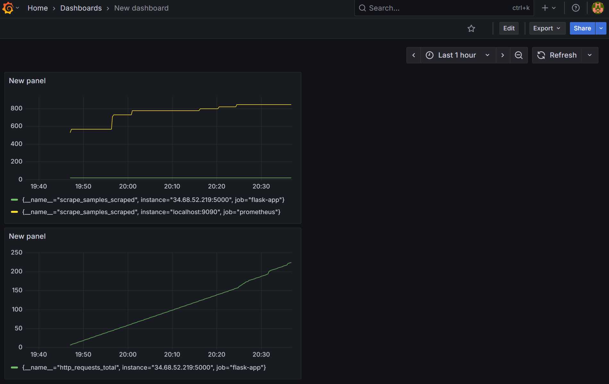

# 📊 **Monitoring Setup — LLMOps Flipkart Product Recommender System**

This stage introduces **real-time monitoring** for the **LLMOps Flipkart Product Recommender System** using **Prometheus** and **Grafana**.
Prometheus is responsible for **collecting and scraping metrics**, while Grafana provides a **visual interface** to observe, analyse, and interpret those metrics through dashboards and visualisations.

The following guide walks through setting up a **dedicated monitoring namespace**, deploying both tools within Kubernetes, and connecting Grafana to Prometheus to visualise live application data.

<p align="center">
  
</p>


## 🧭 **Step-by-Step Setup**

### 1️⃣ Create a Namespace for Monitoring

Open a **new VM terminal** and create a namespace dedicated to monitoring:

```bash
kubectl create ns monitoring
```

**Expected output:**

```
namespace/monitoring created
```

Verify that the namespace has been created successfully:

```bash
kubectl get ns
```

**Expected output:**

```
NAME              STATUS   AGE
default           Active   99m
kube-node-lease   Active   99m
kube-public       Active   99m
kube-system       Active   99m
monitoring        Active   43s
```


### 2️⃣ Deploy Prometheus

Apply the Prometheus configuration file:

```bash
kubectl apply -f prometheus/prometheus-configmap.yaml
```

**Output:**

```
configmap/prometheus-config created
```

Now deploy Prometheus using the deployment file:

```bash
kubectl apply -f prometheus/prometheus-deployment.yaml
```

**Output:**

```
deployment.apps/prometheus created
service/prometheus-service created
```

Verify that the Prometheus pod is running:

```bash
kubectl get pods -n monitoring
```

**Output:**

```
NAME                         READY   STATUS    RESTARTS   AGE
prometheus-6f7fcfdd4-tmt99   1/1     Running   0          45s
```


### 3️⃣ Deploy Grafana

Deploy Grafana next:

```bash
kubectl apply -f grafana/grafana-deployment.yaml
```

**Output:**

```
deployment.apps/grafana created
service/grafana-service created
```

Verify both services are running:

```bash
kubectl get pods -n monitoring
```

**Output:**

```
NAME                         READY   STATUS    RESTARTS   AGE
grafana-6444d486c-dr6gh      1/1     Running   0          116s
prometheus-6f7fcfdd4-tmt99   1/1     Running   0          5m36s
```


### 4️⃣ Access Prometheus Externally

Port-forward the Prometheus service:

```bash
kubectl port-forward --address 0.0.0.0 svc/prometheus-service -n monitoring 9090:9090
```

Copy your **External IP** from the VM dashboard and open it in a browser, followed by `:9090`:

```
http://<your-external-ip>:9090
```

You should now see the **Prometheus dashboard**:

<p align="center">
  
</p>

To verify scraping is working correctly, go to **Status → Target health**.
You should see the following:

<p align="center">
  
</p>

If the **State** is “UP”, the metrics are being scraped successfully.


### 5️⃣ Access Grafana Externally

Open a **third VM terminal**, navigate to your project directory, and run:

```bash
kubectl port-forward --address 0.0.0.0 svc/grafana-service -n monitoring 3000:3000
```

Then in your browser, go to:

```
http://<your-external-ip>:3000
```

You’ll see the **Grafana login page**:

<p align="center">
  
</p>

**Default credentials:**

* Username: `admin`
* Password: `admin`

After logging in, you’ll be greeted by the **Grafana dashboard**:

<p align="center">
  
</p>


### 6️⃣ Add Prometheus as a Data Source

Search for **Data sources** in the Grafana sidebar, then click **Add data source**:

<p align="center">
  
</p>

Select the **Prometheus** option:

<p align="center">
  
</p>

Keep the default name and, under **Prometheus server URL**, enter:

```
http://prometheus-service.monitoring.svc.cluster.local:9090
```

Scroll down and click **Save & test**.

<p align="center">
  
</p>

If successful, Grafana will confirm the connection.


### 7️⃣ Create Grafana Dashboards

Go to **Home → Dashboard → + Create Dashboard → + Add Visualization**, and select the Prometheus data source you just configured.

Scroll to the **Metrics** dropdown — if you can see available metrics, the setup is working:

<p align="center">
  
</p>

Choose a metric such as `http_requests_total`.
Then click **Save dashboard**, and **New dashboard** to view your first visualization:

<p align="center">
  
</p>

Add another visualization to track an internal metric (e.g., `http_requests_created`):

<p align="center">
  
</p>

You will now see both metrics updating in real time — confirming full integration between **Flask → Prometheus → Grafana**.


### 🧹 **Cleanup**

After completing your monitoring setup and testing your dashboards, remember to **delete your VM instance** to avoid unnecessary cloud costs.

```bash
# Example cleanup
gcloud compute instances delete <your-vm-name> --zone=<your-zone>
```

✅ **Monitoring successfully configured!**
Prometheus now scrapes application metrics, and Grafana visualises them in an interactive dashboard.
